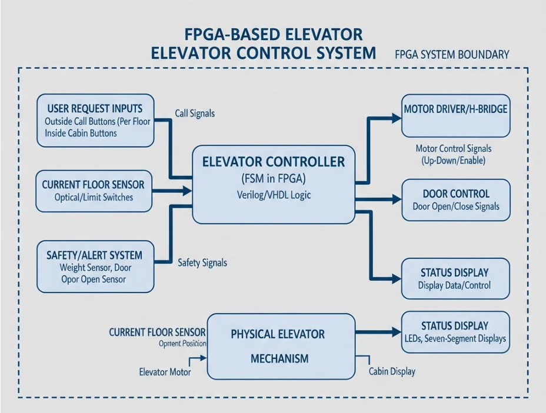
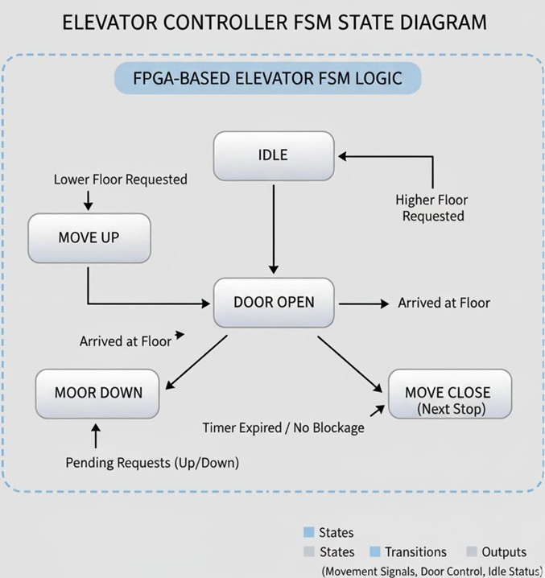
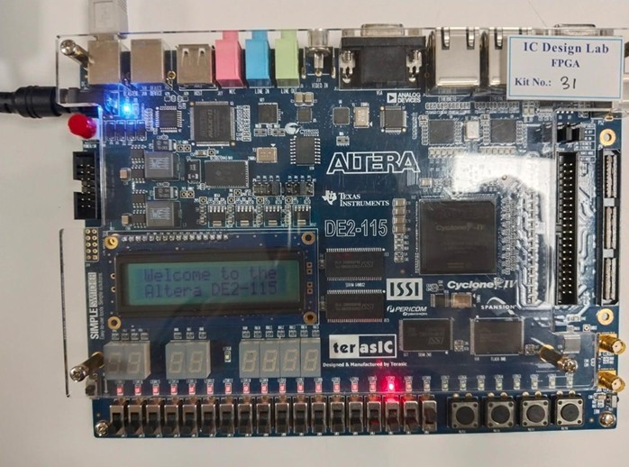

# 🚀 FSM-Based Elevator Controller using FPGA (Verilog HDL)

---

## 📌 Overview

This project implements an **Elevator Control System** using a **Finite State Machine (FSM)** on an FPGA. The system is designed in **Verilog HDL**, simulated using **ModelSim**, and deployed on real hardware using **Intel Quartus Prime**.

It efficiently handles:

* Floor selection
* Elevator movement (Up/Down)
* Door control operations

---

## 🎯 Objective

To design and implement a **real-time elevator controller** using FSM that ensures:

* Deterministic behavior
* Fast response
* Reliable hardware execution

---

## 🧠 Core Concept

The entire system is modeled as a **Finite State Machine (FSM)** with three main states:

* **IDLE** → Waiting for user request
* **MOVE** → Elevator moves up or down
* **DOOR** → Door opens at destination

👉 State transitions depend on:

* Current floor
* Requested floor
* User input

---

## ⚙️ Hardware Components

### 🔧 Main Components

* FPGA Board (Altera DE2-115 / Cyclone IV)
* 50 MHz On-board Clock
* Slide Switches (Floor Selection)
* Push Buttons (Reset & Request)

### 💡 Output Indicators

* LED0 → UP movement
* LED1 → DOWN movement
* LED2 → DOOR OPEN

### 🔌 Supporting

* USB Blaster / JTAG Programmer
* Power Supply
* Computer (Quartus + ModelSim)

---

## 💻 Software & Tools

* **Verilog HDL** → Design & implementation
* **Intel Quartus Prime** → Synthesis & FPGA programming
* **ModelSim** → Simulation & verification

---

## 🔄 Working Principle

1. User selects a floor using switches
2. Presses request button
3. FSM checks direction:

   * If requested > current → Move Up
   * If requested < current → Move Down
4. Elevator moves floor-by-floor
5. On reaching destination:

   * Door opens for a fixed duration
6. System returns to IDLE

---

## 🛠️ Implementation

### 📂 Code Structure

* `src/elevator_controller.v` → FSM logic
* `src/elevator_top.v` → Hardware interfacing
* `src/testbench.v` → Simulation

### ⏱️ Clock Division

* 50 MHz clock divided to slow signal (~1 Hz)
* Makes operation human-visible

### ⏲️ Door Timer

* Counter-based delay in DOOR state

---

## 🧪 Testing & Verification

### ✔ Simulation

* Performed using ModelSim
* Verified:

  * Up/Down movement
  * State transitions
  * Door timing

### ✔ Hardware Testing

* Implemented on FPGA
* LEDs confirmed correct behavior

---

## 📊 Results

### 🔼 Case 1: Floor 0 → 3

* Elevator moves UP
* Stops correctly
* Door opens at destination

### 🔽 Case 2: Floor 3 → 1

* Elevator moves DOWN
* Door opens correctly
* Returns to IDLE

✅ System showed:

* Accurate floor tracking
* Correct direction logic
* Stable FSM transitions

---

## 💡 Skills Gained

### 🔧 Technical Skills

* FPGA Programming
* Verilog HDL
* FSM Design
* Digital Logic Design
* Hardware Debugging
* Simulation (ModelSim)

### 🧠 Practical Skills

* Problem Solving
* System Design
* Debugging
* Team Collaboration

---

## 🌍 Applications

* Elevator systems
* Industrial automation
* Smart buildings
* Robotics control
* Traffic management systems

---

## 🚀 Future Enhancements

* Multi-floor expansion (8–16 floors)
* Multiple elevator coordination
* AI-based scheduling
* IoT integration
* Voice & display systems

---

## 📂 Project Structure

```
FSM-Elevator-Controller
 ┣ 📂 src
 ┃ ┣ elevator_controller.v
 ┃ ┣ elevator_top.v
 ┃ ┗ testbench.v
 ┣ 📂 doc
 ┃ ┣ FSM_Based_Elevator_Controller_VTOP_Report.pdf
 ┃ ┗ FSM_ELEVATOR.pdf
 ┣ 📂 images
 ┃ ┣ FPGA_BOARD.jpg
 ┃ ┣ FPGA_Elevator_Block_diagram.jpg
 ┃ ┗ FPGA_Elevator_FSM_LOGIC_diagram.jpg
 ┣ README.md
```

---

## 📸 System Diagrams

### 🔹 Block Diagram



### 🔹 FSM Diagram



### 🔹 Hardware Setup



---
## 📄 Documentation

- 📘 Full Report: [Open PDF](./doc/FSM_Based_Elevator_Controller_VTOP_Report.pdf)
- 📄 Short Report: [Open PDF](./doc/FSM_ELEVATOR.pdf)
---

## 👩‍💻 Author

**Kesihambigai**
B.Tech Electronics and Communication Engineering
VIT Vellore

---

## ⭐ Final Note

This project demonstrates how **digital design concepts** can be implemented in **real hardware systems**, providing a strong foundation in **FPGA and embedded system design**.
